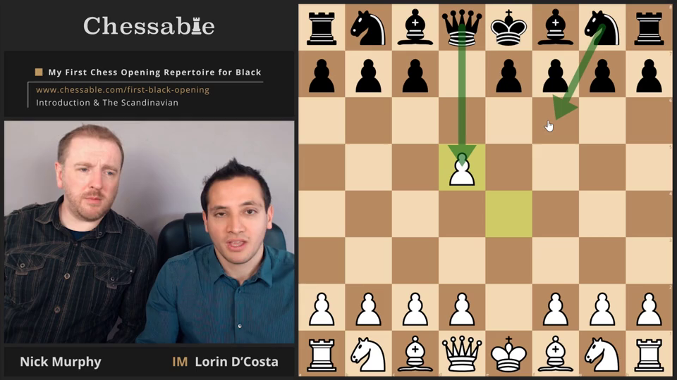
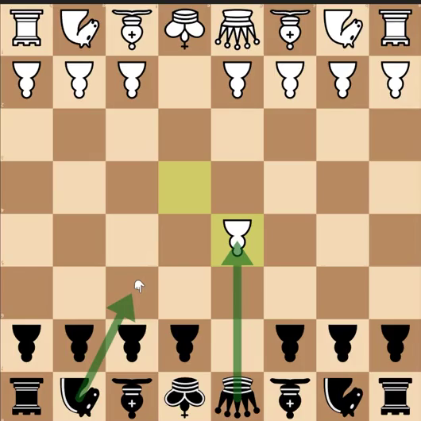
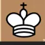
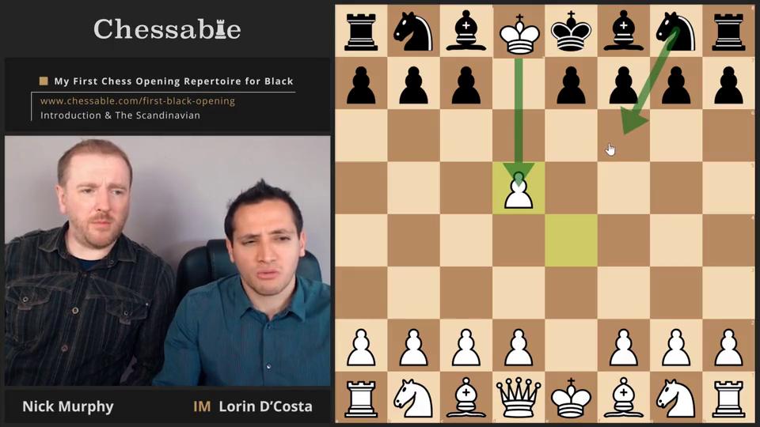
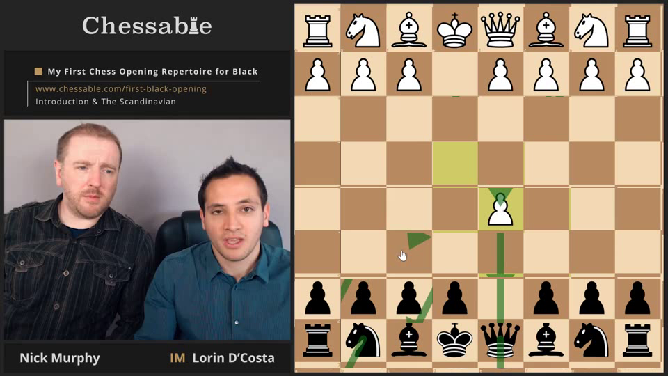

# Chess Video Perspective Fixer™

The Chess Video Perspective Fixer™ takes a video with a 2D chessboard at fixed
pixel co-ordinates and flips the board such that if it was shown from white's
perspective it's now shown from black's perspective and vice-versa.

## Why

There's a course on Chessable - [My First Chess Opening Repertoire for
Black][mfcorb] - that's for learning openings for black, but is displayed from
white's perspective. This is annoying, and I thought it would be a solvable
problem with ffmpeg. Clearly I enjoy shaving yaks.

[mfcorb]: https://www.chessable.com/my-first-chess-opening-repertoire-for-black/course/9014/

## How

```
docker build . -t ffmpeg
docker run --rm -v ${pwd}/data:/var/data ffmpeg /var/data/seg-25-v1-a1.ts /var/data/output.mp4
```

Or just run `ffmpeg.sh` directly if you're on Linux with ffmpeg installed.

You'll need to update the `BOARD_X`, `BOARD_Y`, `BOARD_WIDTH` and `BOARD_HEIGHT`
variables to match the pixels for the chess board displayed 

## What

The original:



Crop out and then flip the board, both vertically (to put black on the bottom)
and horizontally (to put the H file on the left).

```bash
FILTER+="; [board] crop=w=${BOARD_WIDTH}:h=${BOARD_HEIGHT}:x=${BOARD_X}:y=${BOARD_Y}, vflip, hflip [board_flipped]"
```



Since we've flipped the board, we've also flipped all of the individual pieces.
We reflip each piece so it's right-side up. We could just do this by rank
instead of by square, except for the coordinate notation (a - h, 1 - 8) visible in
the top right of some of the individual squares.

```bash
# crop each square
# flip all squares to fix the pieces being upside down
for RANK in {0..7}; do
    for FILE in {0..7}; do
        # this x and y is relative to the board
        SQ_X=$(($FILE * $SQ_WIDTH))
        SQ_Y=$(($RANK * $SQ_HEIGHT))

        SQ_NAME=$(sq_name $RANK $FILE)
        
        FILTER+="; [$SQ_NAME] crop=w=${SQ_WIDTH}:h=${SQ_HEIGHT}:x=${SQ_X}:y=${SQ_Y}, vflip, hflip [${SQ_NAME}_flipped]"
    done
done
```



Then we overlay flipped pieces back on top of the original image.

```bash
# overlay all sections back into one video
OVERLAY_ON="presenters"
for RANK in {0..7}; do
    for FILE in {0..7}; do
        # this x and y is absolute, so we need to add the board x and y
        SQ_X=$(($BOARD_X + $FILE * $SQ_WIDTH))
        SQ_Y=$(($BOARD_Y + $RANK * $SQ_HEIGHT))
        
        SQ_NAME=$(sq_name $RANK $FILE)
        
        OVERLAY_OUT="${SQ_NAME}_overlayed"
        FILTER+="; [$OVERLAY_ON][${SQ_NAME}_flipped] overlay=x=${SQ_X}:y=${SQ_Y} [${OVERLAY_OUT}]"

        # each iteration we overlay on to the previous iteration
        OVERLAY_ON=$OVERLAY_OUT
    done
done

# send through the final overlayed output
FILTER+="; [$OVERLAY_ON] copy"
```

Here's the result with just E8 overlayed.



Here's the result with all squares overlayed.

Sadly the demonstration arrows are mangled. I don't think this is a solvable
problem with this approach. 

The squares are all slightly off, because the `BOARD_X`, `BOARD_Y`,
`BOARD_WIDTH` and `BOARD_HEIGHT` variables are slightly off and I can't be
bothered manually tweaking for hours to get them right. There might also be
issues to do with bash doing integer rounding, and pixels not quite dividing
evenly by the board width and/or height.


